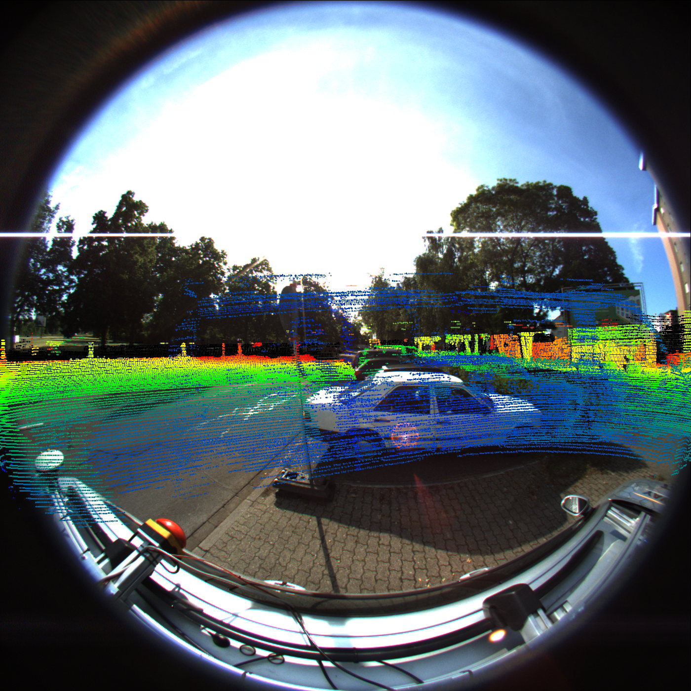
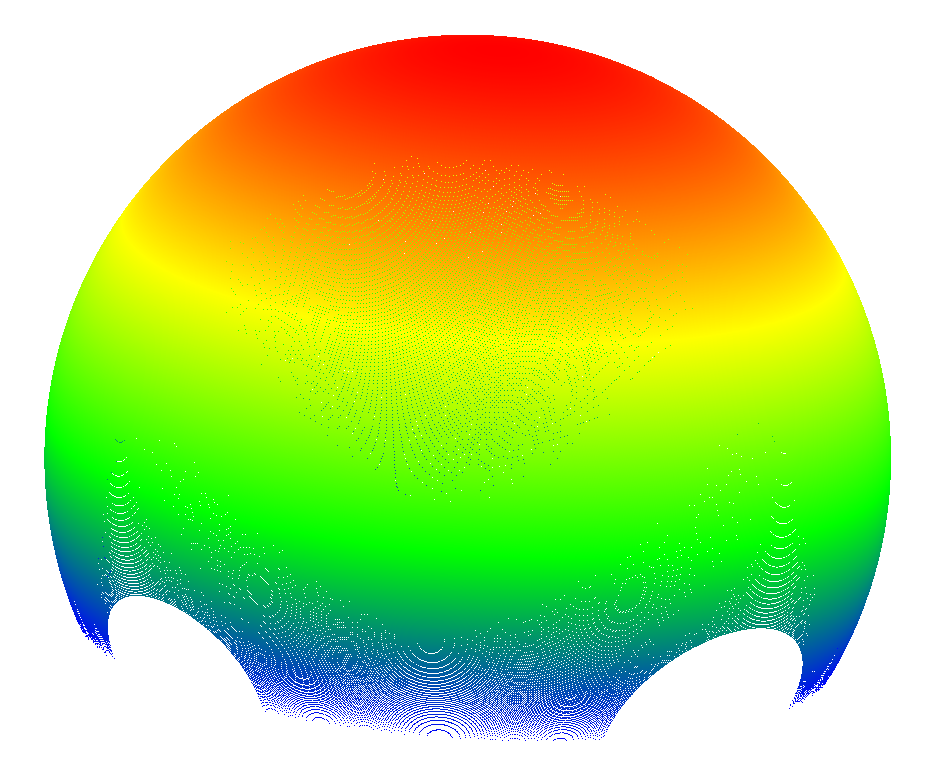

#Main version:
##Source Tree:

* Refine from [CamOdoCal](https://github.com/hengli/camera_model)
* Refined by YZF [dvorak0](https://github.com/dvorak0)
* Modified by LIU Tiambo [GroundMelon](https://github.com/groundmelon)
* Modified by GWL [gaowenliang](https://github.com/gaowenliang)

## Acknowledgements ##

The origin author, Lionel Heng.

## Support Camera Models:

>Pinhole Camera

>Cata Camera（Mei Carema Model）

>Equidistant Camera

>Scaramuzza Camera Model

>Polynomial Fisheye Camera

This is my camera model

>Fov Camera

#Install

To use this package, need:

* [Eigen3](http://eigen.tuxfamily.org/)
* [ROS](http://wiki.ros.org/), almost use indigo version. Deprecated
* [Ceres Solver](http://ceres-solver.org)
* replace the boost shared_ptr to std::shared_ptr

## Calibration:

Use [intrinsic_calib.cc](https://github.com/dvorak0/camera_model/blob/master/src/intrinsic_calib.cc) to calibrate your camera.
The template is like [fisheye_calibration.sh](https://github.com/gaowenliang/camera_model/blob/master/calibrate_template/fisheye_calibration.sh) under scripts folder:

>  ./Calibration --camera-name mycamera --input mycameara_images/ -p IMG -e png -w 11 -h 8 --size 70 --camera-model myfisheye --opencv true

## USE:

Two main files for you to use camera model: [Camera.h](https://github.com/dvorak0/camera_model/blob/master/include/camera_model/camera_models/Camera.h) and [CameraFactory.h](https://github.com/gaowenliang/camera_model/blob/master/include/camera_model/camera_models/CameraFactory.h).
##1.load in the camera model calibration file
Use function in [CameraFactory.h](https://github.com/gaowenliang/camera_model/blob/master/include/camera_model/camera_models/CameraFactory.h) to load in the camra calibration file:

```c++
#include <camera_model/camera_models/CameraFactory.h>

camera_model::CameraPtr cam;

void loadCameraFile(std::string camera_model_file)
{
    cam = camera_model::CameraFactory::instance()->generateCameraFromYamlFile(camera_model_file);
}
```

##2.projection and back-projection point
See [Camera.h](https://github.com/dvorak0/camera_model/blob/master/include/camera_model/camera_models/Camera.h) for general interface:

Projection (3D ---> 2D) function:
[spaceToPlane](https://github.com/gaowenliang/camera_model/blob/master/calibrate_template/fisheye_calibration.sh) :Projects 3D points to the image plane (Pi function)

```c++
#include <camera_model/camera_models/CameraFactory.h>

camera_model::CameraPtr cam;

void loadCameraFile(std::string camera_model_file)
{
    cam = camera_model::CameraFactory::instance()->generateCameraFromYamlFile(camera_model_file);
}

void useProjection(Eigen::Vector3d P)
{
    Eigen::Vector2d p_dst;
    cam->spaceToPlane(P, p_dst);
}
```

Back Projection (2D ---> 3D) function:
[liftSphere](https://github.com/gaowenliang/camera_model/blob/master/calibrate_template/fisheye_calibration.sh):   Lift points from the image plane to the projective space.

```c++
#include <camera_model/camera_models/CameraFactory.h>

camera_model::CameraPtr cam;

void loadCameraFile(std::string camera_model_file)
{
    cam = camera_model::CameraFactory::instance()->generateCameraFromYamlFile(camera_model_file);
}

void useProjection(Eigen::Vector3d P)
{
    Eigen::Vector2d p_dst;
    cam->spaceToPlane(P, p_dst);
}

void useBackProjection(Eigen::Vector2d p)
{
    Eigen::Vector3d P_dst;
    cam->liftSphere(p, P_dst);
}
```

## 实际使用

+ 针孔相机相机标定过程测试通过，很快，而且效果很好。

+ KITTI360中的鱼眼相机使用的缺失是Mei模型，因为参数配置文件都是一样的。KITTI360 公开的python版本的畸变矫正代码估计就是仿照[CamOdoCal](https://github.com/hengli/camera_model)以及后续来写的。但是本项目通过了测试，并且有很多新的模型，也方便进一步修改。特别是新增相机模型标定的情况下。

相机投影和反投影结果。



但是可以发现明显不是很对应，猜测可能是因为RT矩阵给的不对。但是基本流程没问题。



将图像上的点映射到单位球的结果。其中有很多nan的值，手动删掉才能加载。
